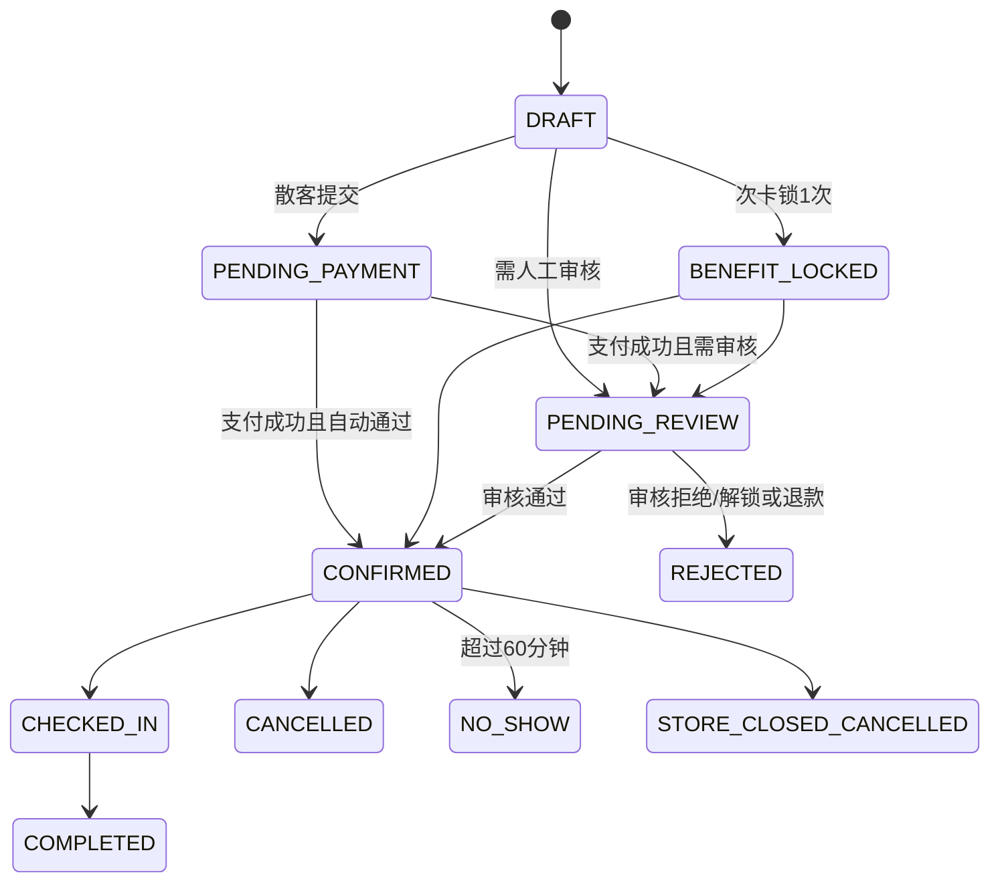
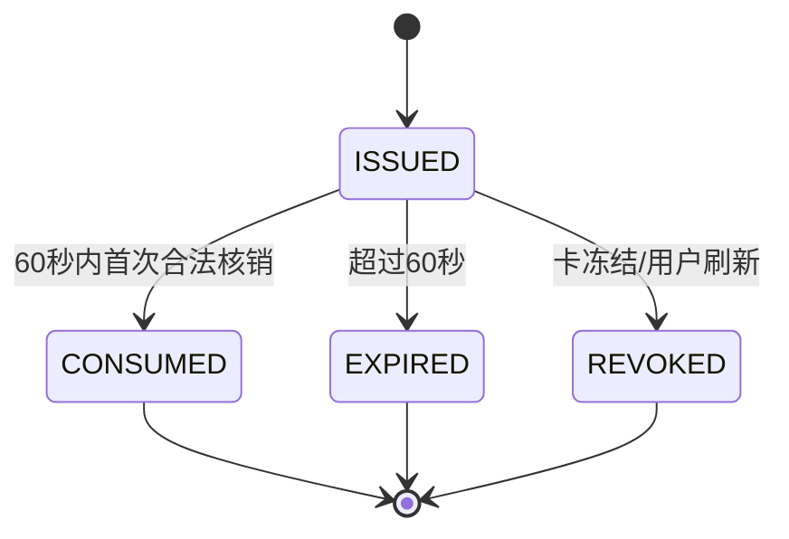
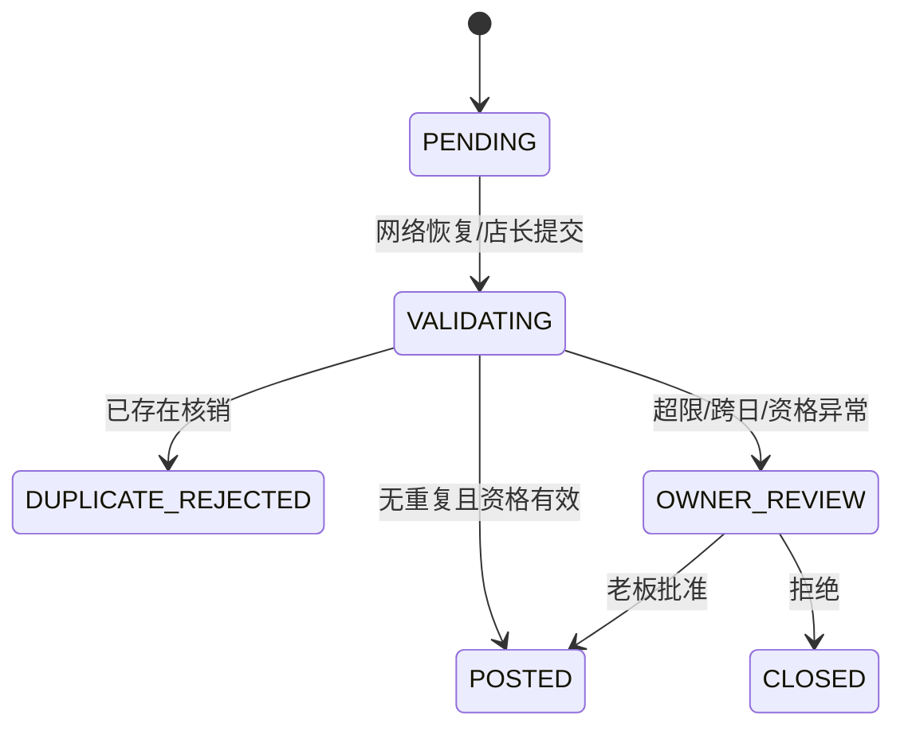
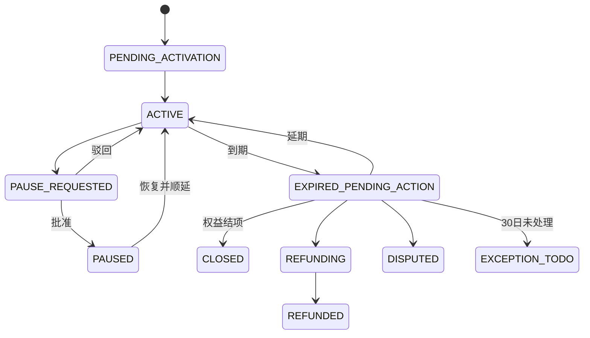
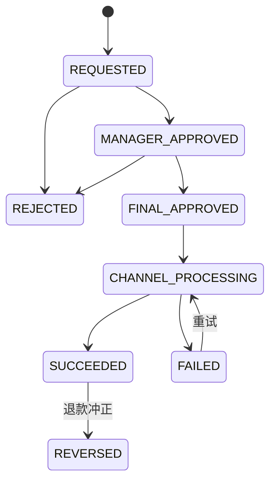
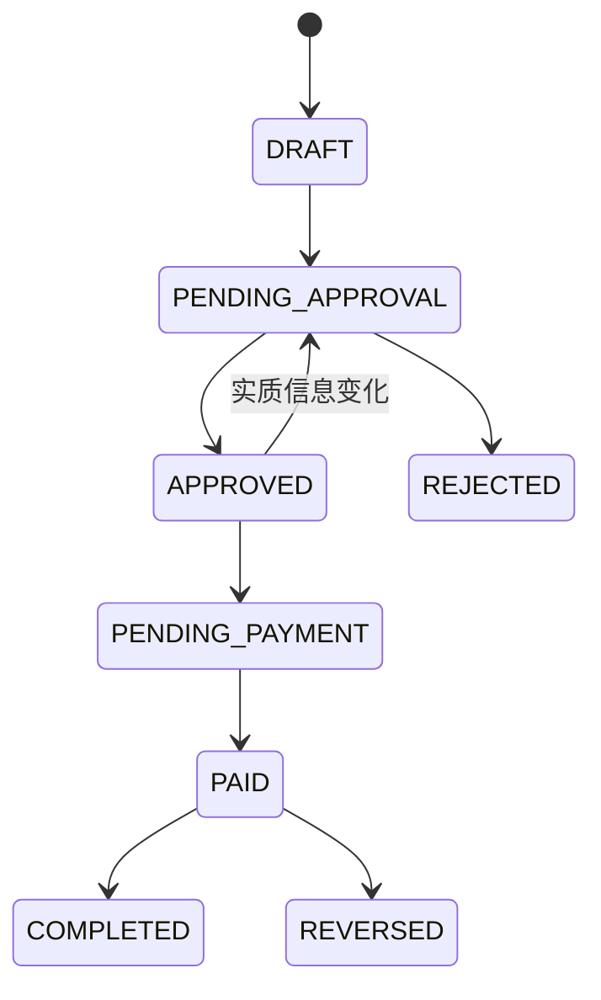
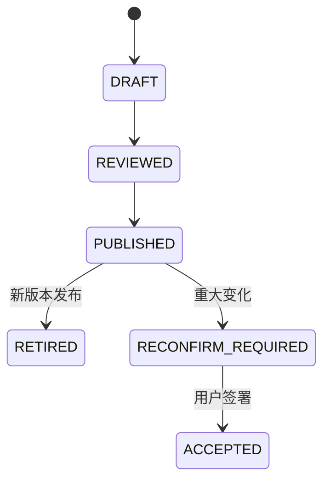

# 关键状态流转 V1.1

日期：2026-07-09

## 1. 预约与权益锁定

取消或拒绝必须解锁次卡；散客按规则退款/改期。

## 2. 动态码与核销

同一nonce、幂等键或核销业务号不可重复成功。

## 3. 弱网补录

## 4. 卡项暂停与到期

暂停期间停止有效期和逐日内部收入摊销。

## 5. 退款

普通员工申请，店长初审，老板/授权财务终审；禁止自批。

## 6. 支出

## 7. 协议

旧版本和签署证据永久保留在规定保存期内，不覆盖。

