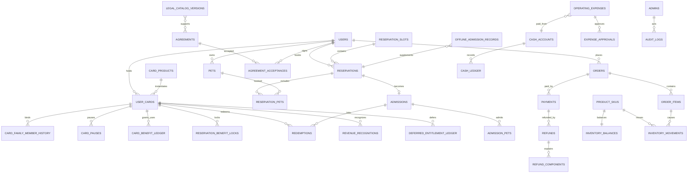

# 核心 ER 图 V1.1

## 关键边界

- `metric_snapshots`、`inventory_balances` 是可重算快照，不是唯一事实源。
- `cash_ledger`、`revenue_recognitions`、`deferred_entitlement_ledger`、`inventory_movements` 是不可删除事实。
- `rules_json/product_snapshot/calculation_snapshot` 保证历史规则不随主数据变化。
- 协议和法规来源通过版本关联，能证明当时使用的依据。

